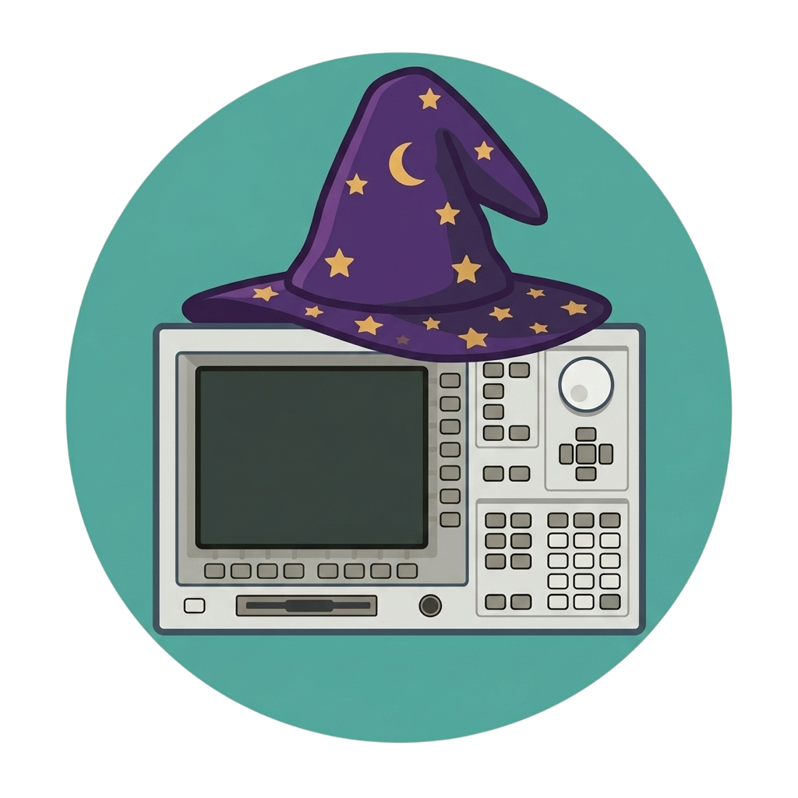
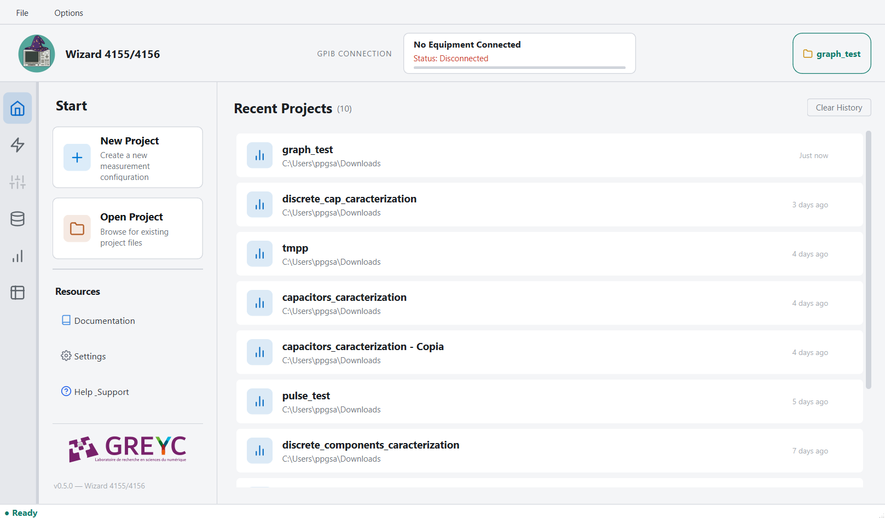
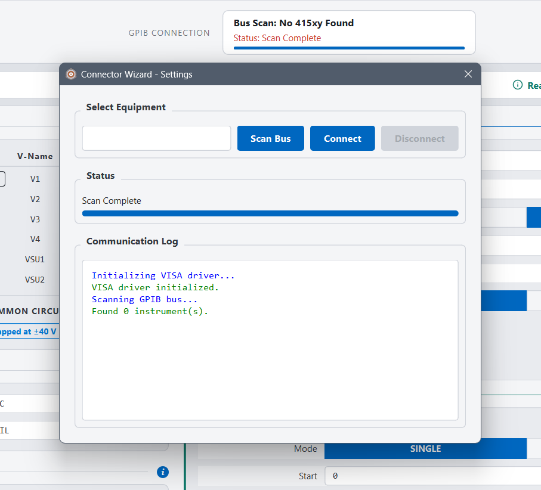
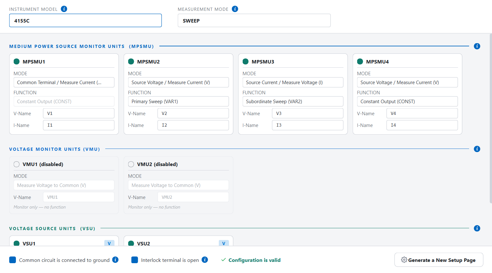
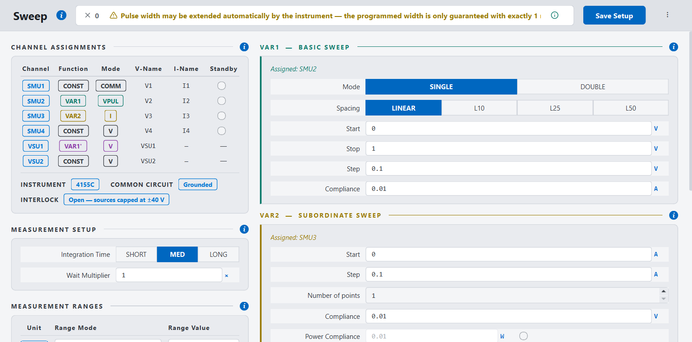
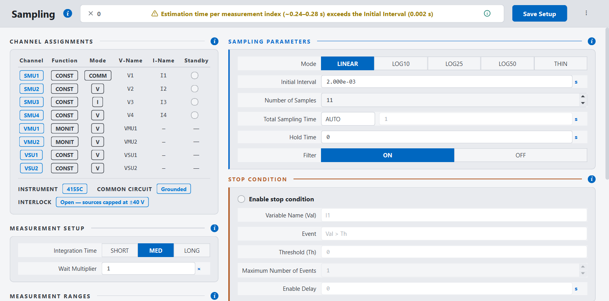
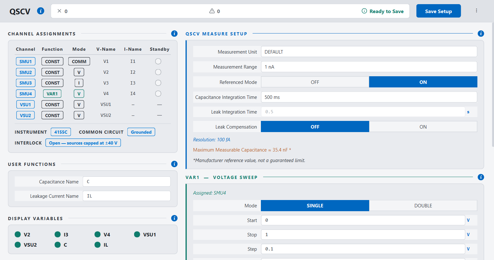
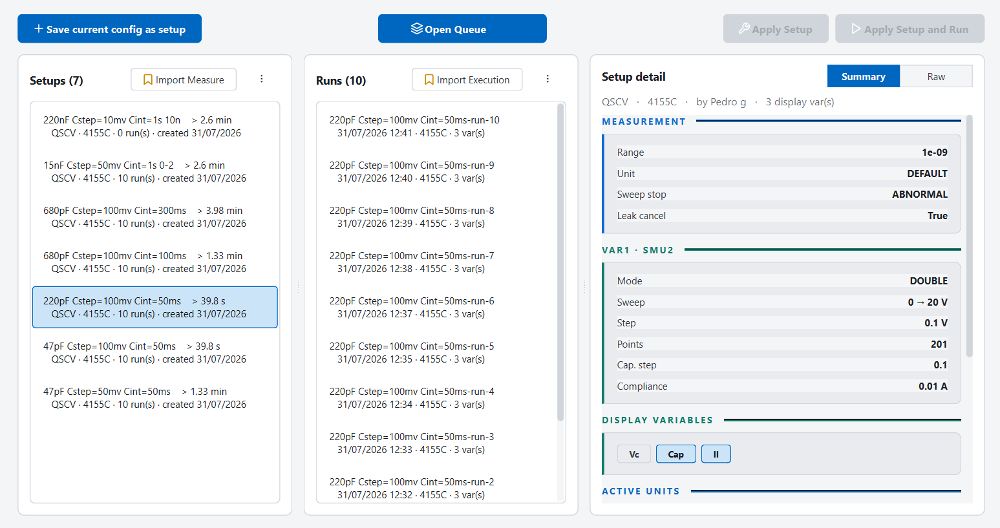
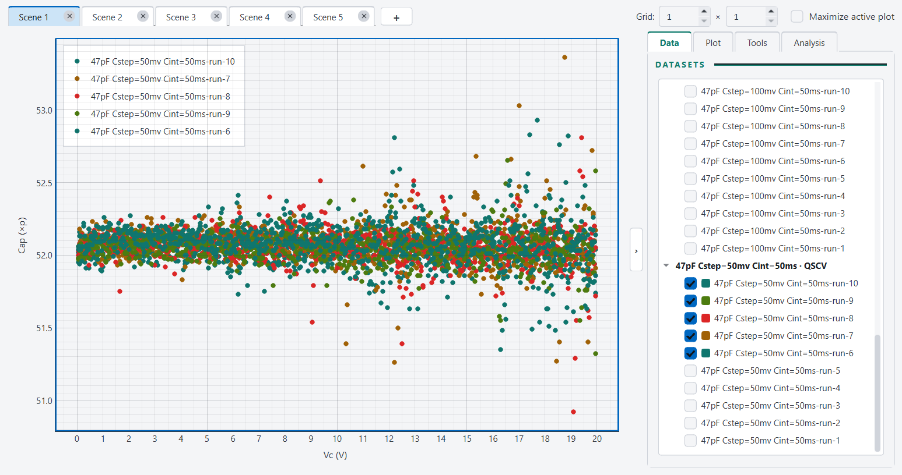
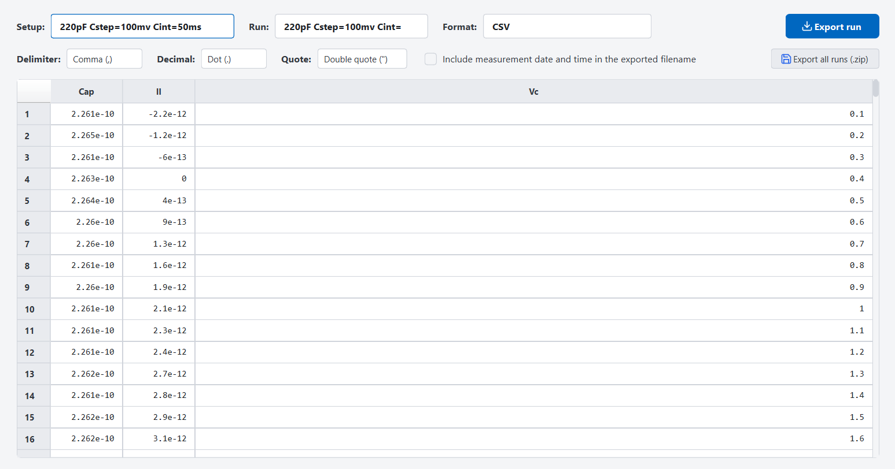

<p align="center">
  
</p>

<p align="center">
  <em>A graphical interface to orchestrate, analyze, and store 4155/4156 measurements.</em>
</p>

<!-- Not yet implemented
<p align="center">
  <a href="https://pedropaulosaraiva.github.io/Wizard-4155-4156/">Website</a> &middot;
  <a href="docs/wizard_4155_4156_manual.pdf">User Manual (PDF)</a>
</p>
-->
<!-- Not yet implemented
<p align="center">
  English |
  <a href="README.pt-BR.md">Português (BR)</a> |
  <a href="README.fr.md">Français</a>
</p>
-->
**Wizard 4155/4156** is a software tool designed to automate workflows for the Agilent (now Keysight) 4155 and 4156 Semiconductor Parameter Analyzers: define every parameter of your characterization as a setup to ensure reproducibility, organize all your measurements as runs attached to the setups, and analyze your data with interactive sets of plots assembled as scenes. Everything is stored in a simple local file that is easily shared.

Supported instruments are the 4155A/B/C and 4156A/B/C. QSCV requires a C-series mainframe.

You do not need an instrument to use it. VISA loads on your first bus scan, not at startup, so
with no driver and no hardware you can still build and validate configurations, import CSV data,
plot, fit and export. The instrument is only needed to take new measurements.

**How it works**

1. Create a project. One project is one `.wiz4155` file.
2. Scan the GPIB bus and connect.
3. Set up the channels.
4. Configure the measurement.
5. Save it as a setup, apply it, run it.
6. Plot, fit and export.

## Features

- **Channels.** Four SMUs, two VMUs and two VSUs, each on its own card. Pick the SMU mode
  (`V`, `I`, `VPULSE`, `IPULSE`, `COMM`) and its role in the sweep (`CONST`, `VAR1`, `VAR2`,
  `VAR1'`). Voltage limits follow the *Interlock Open* and *Common to Ground* switches on their
  own.
- **Three measurement modes.** Staircase sweep, time-domain sampling and quasi-static C-V. Each
  one gets its own configuration page, built from your channel layout.
- **Validation while you type.** Errors block saving; warnings do not. Point count, index count
  and estimated run time update on every edit, computed from the instrument's own
  integration-time tables.
- **One file per project.** A `.wiz4155` file is a SQLite database holding your setups, runs,
  measured data and graphs. Copy it, back it up, hand it to a colleague.
- **Graphs.** Up to nine plots per scene. Log axes, cursors that snap to real data points,
  region selection, polynomial fits to degree 6, derivatives, and math between traces.
- **Export.** CSV and XLSX, or ready-to-run Python, C/C++ and MATLAB. PNG for any plot. A
  whole setup as a zip.
- **Queue and import.** Line up several setups and let them run in order. Bring in measurements
  taken elsewhere from CSV.

## Screenshots

<!-- Images live in assets/screenshots/. See that folder's README for names and sizes. -->

<table>
  <tr>
    <td width="33%" align="center">
      <a href="assets/screenshots/main-window.png"></a>
      <br><sub><b>Main window</b></sub>
    </td>
    <td width="33%" align="center">
      <a href="assets/screenshots/connection.png"></a>
      <br><sub><b>Connection wizard</b></sub>
    </td>
    <td width="33%" align="center">
      <a href="assets/screenshots/channels.png"></a>
      <br><sub><b>Channels</b></sub>
    </td>
  </tr>
  <tr>
    <td width="33%" align="center">
      <a href="assets/screenshots/sweep-config.png"></a>
      <br><sub><b>Sweep configuration</b></sub>
    </td>
    <td width="33%" align="center">
      <a href="assets/screenshots/sampling-config.png"></a>
      <br><sub><b>Sampling configuration</b></sub>
    </td>
    <td width="33%" align="center">
      <a href="assets/screenshots/qscv-config.png"></a>
      <br><sub><b>QSCV configuration</b></sub>
    </td>
  </tr>
  <tr>
    <td width="33%" align="center">
      <a href="assets/screenshots/project-data.png"></a>
      <br><sub><b>Project data</b></sub>
    </td>
    <td width="33%" align="center">
      <a href="assets/screenshots/graph-view.png"></a>
      <br><sub><b>Graph view</b></sub>
    </td>
    <td width="33%" align="center">
      <a href="assets/screenshots/table-view.png"></a>
      <br><sub><b>Table and export</b></sub>
    </td>
  </tr>
</table>

## Quick start

### Windows build

No Python needed.

1. Download the archive from the
   [latest release](https://github.com/pedropaulosaraiva/Wizard-4155-4156/releases/latest).
2. Extract it somewhere you can write to.
3. Run `wizard_4155_4156.exe`.
4. Create a project, then open *Options ▸ Connection Wizard* and scan the bus.

### From source (Ubuntu 22.04+ or Windows, other distributions may work if supported by [Qt 6.11](https://doc.qt.io/qt-6/supported-platforms.html))

Requires [uv](https://docs.astral.sh/uv/), an easily installed Python package and project manager.

```bash
git clone https://github.com/pedropaulosaraiva/Wizard-4155-4156.git
cd Wizard-4155-4156
uv sync

uv run task run        # launch the GUI and that's all there is to it.
```

### To reach an instrument

PyVISA uses whatever VISA runtime is installed on the machine. None is bundled, so you need:

- **NI-VISA / NI-488.2** or the **Keysight IO Libraries Suite**
- a GPIB interface, such as a Keysight 82357B or an NI GPIB-USB-HS
- a 4155A/B/C or 4156A/B/C on the bus

Missing any of these, the application still runs. Only acquisition is unavailable.

### Built with

Python 3.12, PySide6, pyqtgraph, PyVISA, SQLAlchemy and NumPy, packaged with Nuitka. The code
follows a passive-view MVP layout.

## About the project


**Wizard 4155/4156** was developed at the GREYC Laboratory by Pedro Saraiva during an internship. The project was supervised by Bruno Guillet, Chantal Gunther, and Jeremy Blond.

<p align="center">
  
</p>

## Contact

Pedro Saraiva — <pp.guedessaraiva@gmail.com>

Bugs and feature requests go to the
[issue tracker](https://github.com/pedropaulosaraiva/Wizard-4155-4156/issues).

## License

GNU General Public License v3. See [LICENSE](LICENSE).

Not affiliated with or endorsed by Keysight Technologies or Agilent Technologies. "4155" and
"4156" are product names of their respective owners, used here only to identify compatible
hardware.
